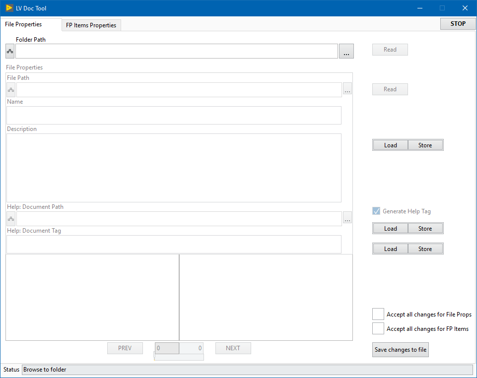
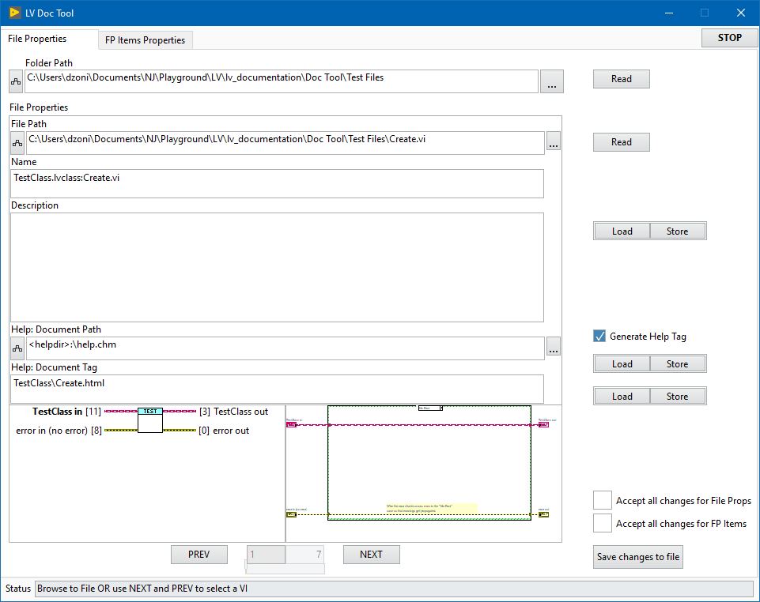
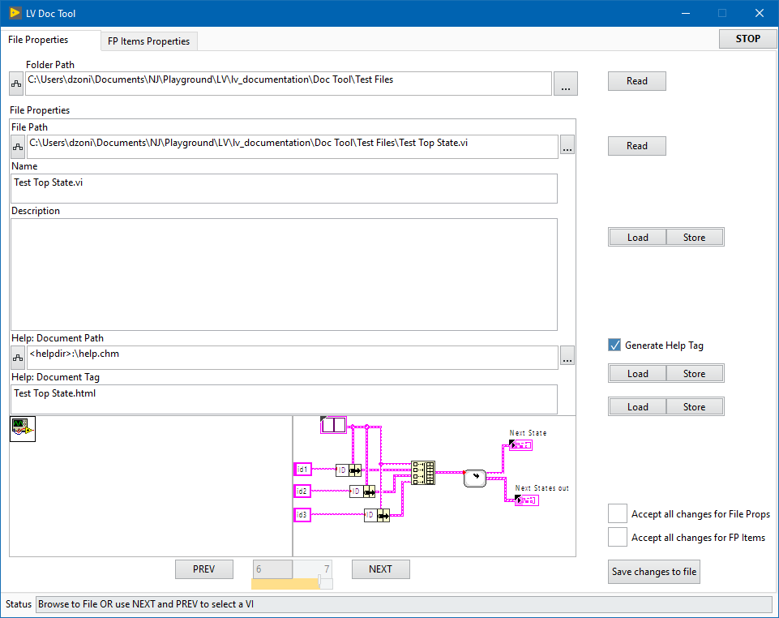
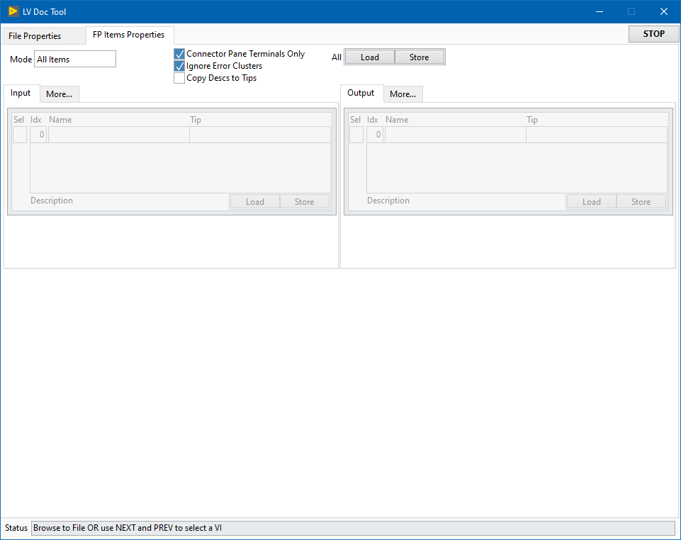
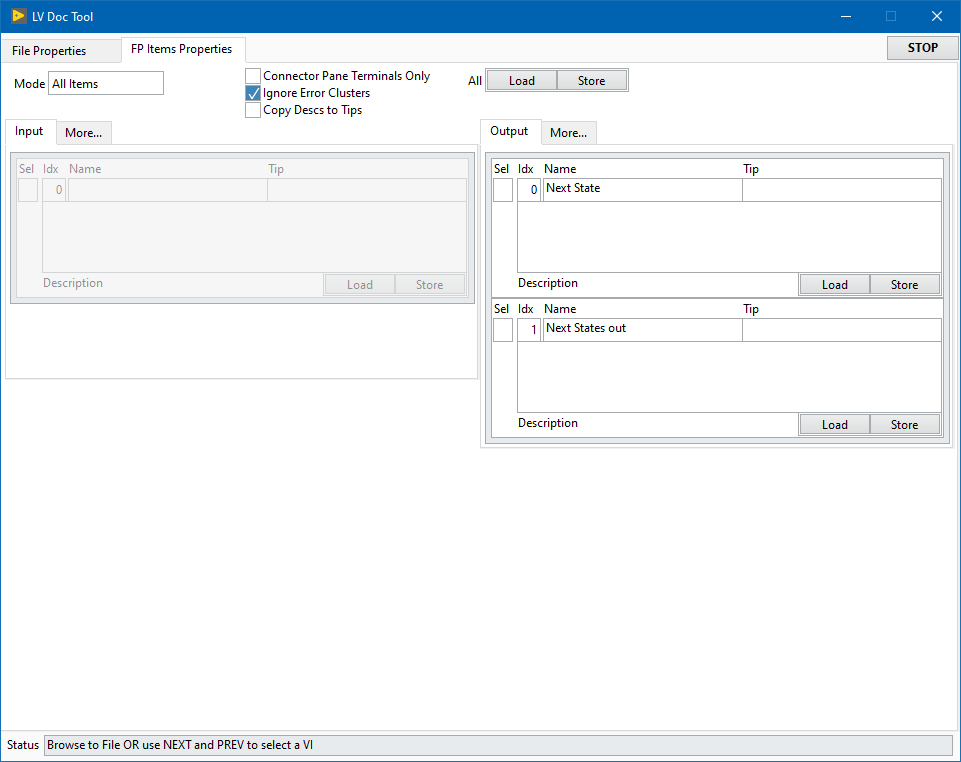
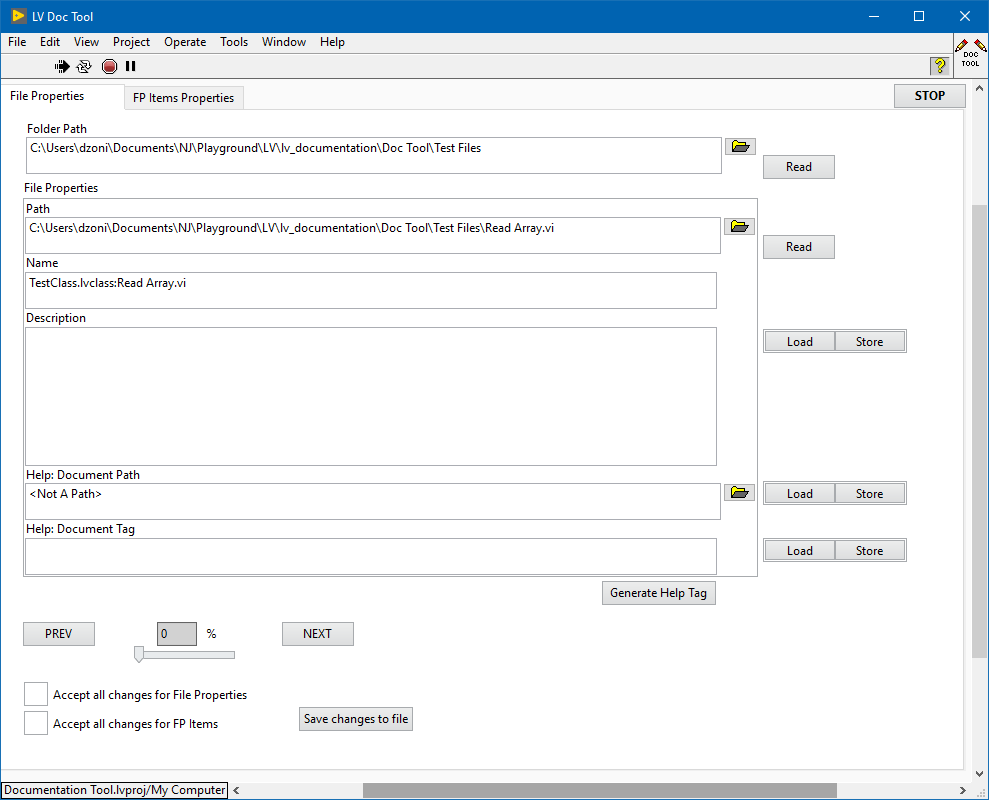
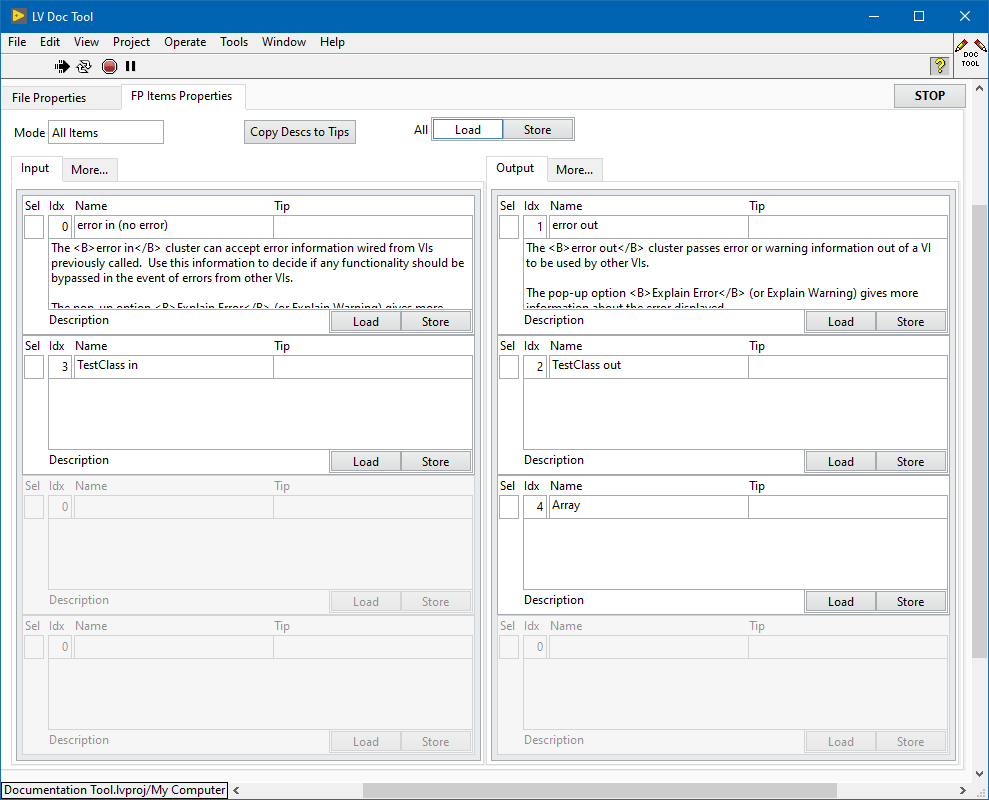

# lv_documentation

### UI Layout  

 
 

  

### Table of Contents (Wiki)
[Wiki Home](https://github.com/etfovac/lv_documentation/wiki)  
[Overview](https://github.com/etfovac/lv_documentation/wiki/Overview)  
[Notes](https://github.com/etfovac/lv_documentation/wiki/Notes)  
[Examples](https://github.com/etfovac/lv_documentation/wiki/Examples)  
[References](https://github.com/etfovac/lv_documentation/wiki/References)  

[lv_documentation](https://github.com/etfovac/lv_documentation) is maintained by [etfovac](https://github.com/etfovac).
