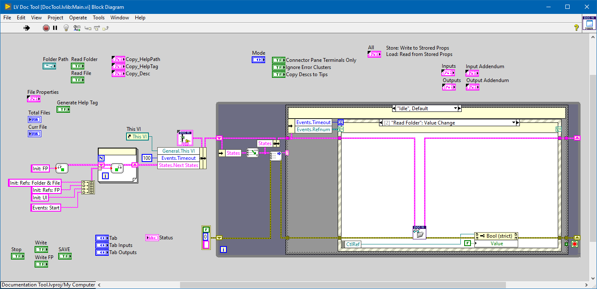

## Documentation Tags Editor
   

### Table of Contents (Wiki)
[Wiki Home](https://github.com/etfovac/lv_documentation/wiki)  
[Overview](https://github.com/etfovac/lv_documentation/wiki/Overview)  
[Notes](https://github.com/etfovac/lv_documentation/wiki/Notes)  
[Examples](https://github.com/etfovac/lv_documentation/wiki/Examples)  
[References](https://github.com/etfovac/lv_documentation/wiki/References)  

LabVIEW tool for parsing and editing documentation Tags for: 
* VI files (*Name*, *Description*, *Help Path*, *Help Tag*) and 
* Front Panel items (*Index*, *Description*, *Tooltip*).

It loads a folder of VI files and goes through them one by one (buttons *Prev* and *Next*).  
Both Front Panel (FP) and Block Diagram (BD) of a currently selected VI are shown (using VI Scripting, see: [References](https://github.com/etfovac/lv_documentation/wiki/References)).  
All FP items are listed, terminals and error clusters can be ignored. 

It's based on an event driven string state machine with local context cluster and custom library with utilities for parsing and inserting states. 

Link to NI Community's page [Example-Code/Documentation-Tags-Editor](https://forums.ni.com/t5/Example-Code/Documentation-Tags-Editor/ta-p/4167894) 

### UI Layout (Front Panel, FP)  

<!--  --> 
 

<!--  --> 

  

### Block Diagram (BD)

[lv_documentation](https://github.com/etfovac/lv_documentation) is maintained by [etfovac](https://github.com/etfovac).
