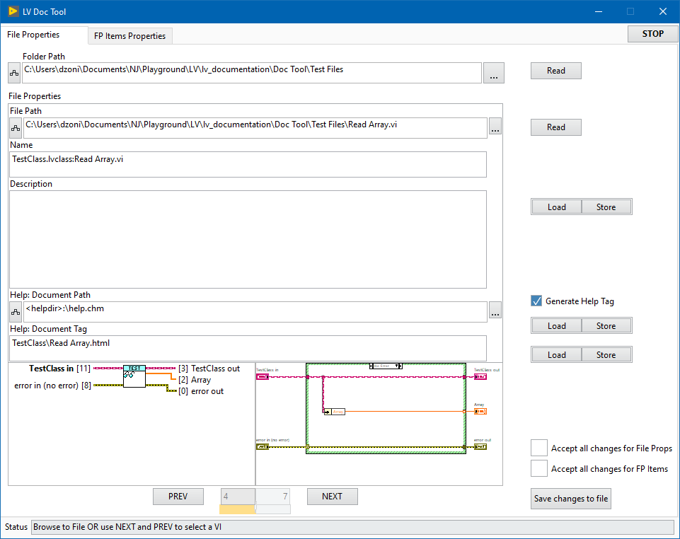

### lv_documentation

## Documentation Tags Editor
   

LabVIEW tool for parsing and editing documentation Tags for VI files (Name, Description, Help Path, Help Tag) and Front Panel items (Index, Description, Tooltip).

It loads a folder of VI files and goes through them one by one.

Both FP and BD of currently selected VI are shown.

All FP items are listed, terminals and error clusters can be ignored. 

It's based on an event driven string state machine with local context cluster and custom library with utilities for parsing and inserting states.

### UI Layout  

 
 

  

### Table of Contents (Wiki)
[Wiki Home](https://github.com/etfovac/lv_documentation/wiki)  
[Overview](https://github.com/etfovac/lv_documentation/wiki/Overview)  
[Notes](https://github.com/etfovac/lv_documentation/wiki/Notes)  
[Examples](https://github.com/etfovac/lv_documentation/wiki/Examples)  
[References](https://github.com/etfovac/lv_documentation/wiki/References)  

[lv_documentation](https://github.com/etfovac/lv_documentation) is maintained by [etfovac](https://github.com/etfovac).
